# Leight 代码编程指南

本指南为Leight物联网台灯的代码编程指南

## 前言

本指南基于LeLink的Leight版本编写，旨在对可视化编程中每个模块进行梳理和解析，
并提供一小段测试案例以供用户实践。

## 模块详解

### 逻辑-如果

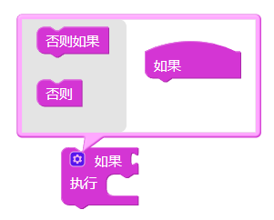

1. 该积木用于逻辑判断,根据<判断条件>的`True`（真、存在、对）或`False`（假、不存在、不对）定是否执行内部的代码
2. 一个判断积木可以扩展,可以添加否则如果和否则
3. 否则如果:当前一个<判断条件>为False时在进行一次别的判断,否则不会进行判断也自然不会执行对应的代码
4. 否则:当前一个<判断条件>为False时执行内部的函数
#### 示例

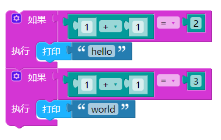
上图展示了两个并列的如果积木,第一个判断条件成立,shell中会输出'hello'. 第二个判断条件不成立,不会输出'world'

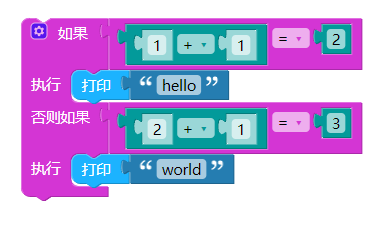
上图中,虽然两个判断条件都是成立的,但是只会输出 'hello'.

### 逻辑-比较
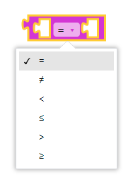

1. 该积木用于比较左右两边的值
2. 该积木有多种可选的比较模式,当判断成立时,这个积木整体就代表`True`,否则代表`False`
3. 通常该积木与如果积木搭配使用
4. 使用该积木进行比较的前提是左右两边类型相同;如果出现无法放入的情况,可以先赋值给变量,再使用变量进行比较

#### 示例
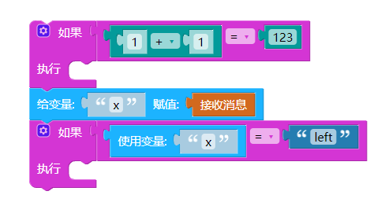

上图展示了两种使用的方法,分别是直接比较和实用变量进行比较.

当要把同一个数据进行多次比较时也可以使用变量比较,有利于增加可读性

### 逻辑-或/与
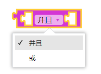

1. 该积木用于进行或/与判断
2. 并且:两边都为`True`时该积木整体为`True`,否则为`False`
3. 或:有一边为`True`时该积木整体为`True`,当两边都为`False`时整体为`False`
4. 或/与逻辑要与'逻辑门'区分,'False 并且 False'的结果是False而不是True  

[//]: # (4. 
或/与逻辑要与'逻辑门'区分,'False 并且 False'的结果是False而不是True
)  

#### 示例

上图为比较积木与或/与积木的组合使用,其左边为True,右边为False,所以整体结果为False

### 逻辑-非

1. 该积木用于非运算,会将`True`变为`False`,也会将`False`变为`True`

### 逻辑-空

1. 该积木用于提供一个空值
2. 这个空代表真正的空,包括其类型也是空类型
#### 示例
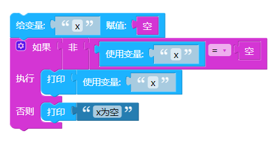

上图进行了一个稍复杂的判断,先给x赋值为空,再判断x如果不为空则打印x的值,否则打印'x为空'.

结果是,<判断条件>整体为`False`,所以会打印'x为空'

### 逻辑-true/false
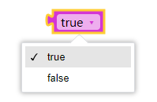
1. 该积木用于提供`True`和`False`的布尔值
2. 通常和条件循环搭配形成'一直循环',对于复杂的流程控制时也会使用到

### 循环-条件循环

1. 该积木用于条件循环,当<循环条件>整体为`True`时会执行循环体内的代码
2. 当设置为'一直循环'(死循环)时要特别注意,加入等待积木进行休眠,防止死机.
3. 循环是阻塞的
#### 示例
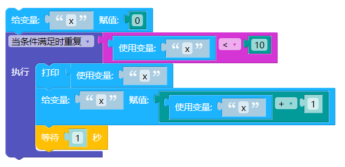

上图先给x赋值为0,接着当x<10时会执行循环.  
循环体:先打印当前x变量,x+1后再赋值给x,接着等待1秒.  
结果:shell输出0到9.  
当输出9后x又加1,此时x为10不符合循环条件,循环结束.

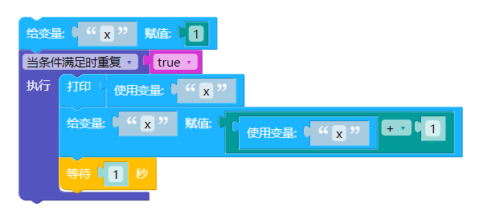
上图我们将循环条件换成了`True`,由于循环条件永远为真,所以会一直循环.
除非使用跳出循环积木来主动打断循环.

### 循环-‌迭代式循环1

1. 该积木提供了变量迭代递增的循环
2. 自定义的变量不建议与循环的变量冲突
3. 循环体内可以直接使用循环提供的变量
4. 如上图所示,该循环会执行10次,变量i的值也会从1开始,每次循环结束+1,当为11时循环结束
5. 循环是阻塞的

### 循环-‌迭代式循环2

1. 该积木提供了对列表的遍历循环,也是迭代式循环的一种
2. 不同于变量迭代递增的循环,这个积木会将列表内的元素从头到尾依次赋值给i,并执行循环体.列表遍历完后循环也结束
3. 循环是阻塞的
#### 示例
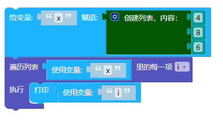
如上图所示,先创建列表并赋值给x,再对x进行遍历.  
循环体:打印i的值,i的值依次为列表里的值  
结果: shell依次输出4,8,6

### 循环-‌跳出循环
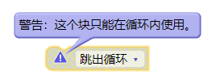
1. 这个积木用于跳出循环,也只能在循环内使用
2. 跳出循环只会跳出当前的循环, 如果当前循环外部还有循环的话, 外部循环会继续

### 数字-数字类型
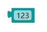
1. 该积木用于提供数字类型的值
2. 其值可以是整数,小数,负数

### 数字-运算
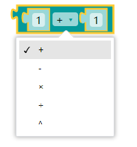
1. 这个积木用于进行简单的数学运算
2. `^`为乘方,使用此符号时,左边为底数,右边为指数
:::tip
该积木由运算积木加上两个数字类型积木组成,但是数字类型积木颜色稍透明,这种积木称之为shadow.  
shadow可以理解为是一种默认值,在运算积木中,我们可以用能进行数学运算的积木对默认值直接进行替换
:::  
#### 示例

### 数字-取余数

1. 该积木用于计算余数
2. mod左边为被除数,右边为除数,上图计算结果为0

### 数字-运算2
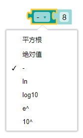
1. 该积木用于提供更特殊的数学计算,包括平方根,绝对值,取负,对数运算,自然对数,科学计数

### 数字-去小数
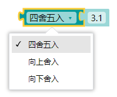
1. 该积木用于对数字去小数
2. 该积木提供了三种去小数的方法,可以根据需求自行选择
3. 上图中,3.1向上舍入为4,向下为3.  当去小数目标为负数时需要注意,-3.1向上舍入为-3,向下为-4

### 数字-随机数

1. 该积木用于提供设定范围内的随机整数

### 字符-字符串

1. 该积木用于提供自定义字符串
2. 字符串是由数字、字母、标点等字符组成的,可以简单理解为正常的文本
3. 字符串'1'与数字1虽然使用打印积木输出后都一样,但是他们类型不同,不能一概而论

### 字符-字符串拼接

1. 该积木用于字符串拼接
2. 该积木既可以用于字符串与字符串之间的拼接,也可以用于数字与字符串的拼接;数字与字符串拼接时,数字会被自动转化为字符串
#### 示例
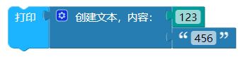
如上图所示,将数字123与字符串'456'拼接,并输出  
结果:shell打印 123456

### 字符-字符串长度

1. 该积木用于测量并输出字符串的长度
2. 空格,标点等都会被记录,上图的长度则为3

### 字符-搜索字符串

1. 该积木用于搜索制定字符串变量中是否有指定的字符串
2. 如果搜索成功,则返回出现的位置在第几个字符,如果没找到,则输出0  
:::tip
在编程语言中有一个下标(index)的概念,即第一个字符的下标为0,后续依次递增  
可视化编程视是为编程初学者量身定制, 为了方便理解,搜索字符串的结果都会加一,以符合直观感受
:::
#### 示例
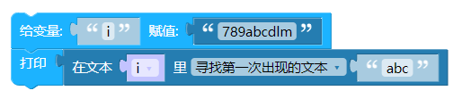
如上图所示,将包含'abc'的字符串赋值给变量i,再用搜索字符串积木搜索'abc'的位置
结果: shell输出 4

### 字符-截取字符串
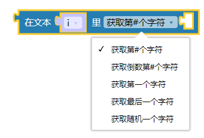
1. 该积木用于截取字符串某个位置上的字符
2. 该积木如图所示有多重模式可以选择,有'#'的模式需要放入数字积木来指定

### 字符-截取字符串2

1. 该积木用于截取字符串某个位置到某个位置上的字符
2. 该积木如图所示有多重模式可以选择,有'#'的模式需要放入数字积木来指定
#### 示例

如上图所示,我们截取了字符串第4到第6的字符串  
结果:shell输出 abc

### 列表-创建列表
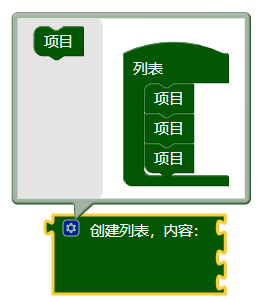
1. 该积木用于创建列表
2. 列表可以放入数字,字符串,字典等各种类型的值
3. 创建时,如果积木右侧留有空槽,空槽也会占用列表内容,其值为`None`

### 列表-列表长度

1. 该积木用于计算并输出列表的长度
2. 列表的长度等于列表的元素个数,具体元素的长度不会影响列表长度

#### 示例
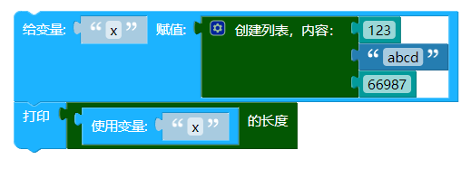
如上图所示,我们创建了拥有三个元素的列表并赋值给x
结果:shell输出 3

### 列表-列表获取元素
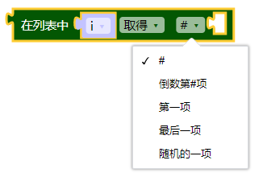
1. 该积木用于获取列表指定的某个元素
2. 当列表只有一个元素的时候,第一项与最后一项相等

### 列表-修改元素
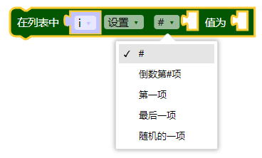
1. 该积木用于修改指定的某个元素
2. 修改元素是直接覆盖,所以不需要考虑类型.假设第2个元素是数字,我们可以直接修改为字符串

### 列表-列表排序

1. 该积木用于列表内部元素的排序
2. 升序为从小到大,降序则反之
3. 按字母升序排序时,顺序从a到z,大写在前

#### 示例
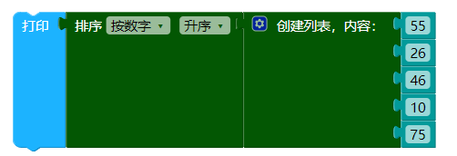
如上图所示,我们创建了拥有5个元素的列表并按数字升序排序  
结果:shell输出 [10, 26, 46, 55, 75]

### 变量-定义变量

1. 该积木用于定义变量,可自定义变量名,放入任意类型的值
2. 赋值的空槽不应空着,否则会报错. 有特殊需求需要一个空变量时可以放入逻辑-空积木.

### 列表-使用变量

1. 该积木用于声明指定变量名为全局变量
2. 在函数,事件等积木中使用外部定义的变量时,我们只可以读取,但是不能修改. 若要对外部定义的变量修改,则要声明全局变量

#### 示例
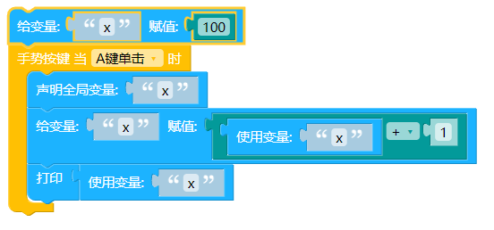
如上图所示,手势按键是一个事件.在外部将100赋值给x,事件内先声明x为全局变量,再给x赋值为x+1,最后打印输出.   
结果: A键单击后,shell输出 101,再次点击为 102,以此类推  
:::tip
假如没有声明全局变量x,那么给x赋值为x+1时就会报错.  
还有一种办法, 就是在内部再次给x赋具体的值来声明,此时x值的变化只在内部有效,外部的x永远为100
:::

### 函数-定义函数

1. 该积木用于定义函数
2. 如有多个参数,可以用英文逗号隔开
3. 函数内部如要使用外部变量需先声明全局变量
4. 如果该函数没有需要返回的值,返回处的积木槽可以为空
5. 函数内部定义的变量名与声明的全局变量名,不应当与参数名重复,否则会覆盖参数的值

### 函数-使用函数

1. 该积木用于使用已定义的函数

#### 示例
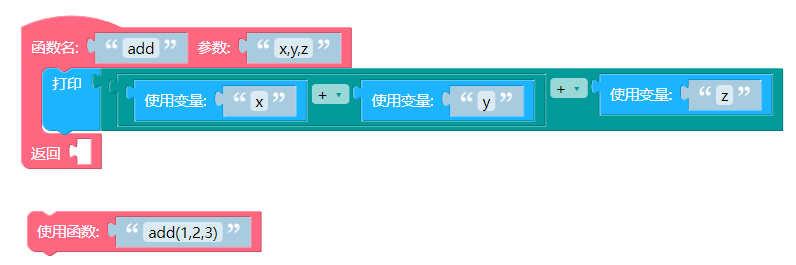
如上图所示,其中定义了一个名叫add的函数,并要求传入x,y,z三个参数.  
函数体中,将x,y,z相加并输出.  
接着在程序中使用函数,通过写入'add(1,2,3)'来执行这个函数并传入三个数字作为参数.括号内的1,2,3的与定义时的x,y,z按照顺序一一对应.  
结果: shell打印输出 6

### 输入-等待一秒

1. 该积木用于让程序等待指定的时间
2. 一般用于循环中,防止某些性能消耗大的程序运行过快

### 输入-环境亮度

1. 该积木用于检测输出环境周围的亮度
2. 其值范围0到4095,值越大,代表周围环境光照越亮

### 输入-环境声音

1. 该积木用于检测输出环境周围是否有声音
2. 其值为0或1,0代表没检测到声音,1代表检测到声音

### 输入-霍尔传感器

1. 该积木用于检测磁场强度
2. 其值为0或1.检测点在台灯顶部,当台灯吸附上灯座时霍尔传感器的值为1,拿下来时为0

### 输入-人体雷达

1. 该积木用于检测台灯周围是否有人存在
2. 其值为0或1,没人时返回0,有人时返回1
3. 人体雷达较为灵敏,一般需要人走出房间关上门才不会被检测到

### 输入-台灯亮度

1. 该积木用于读取当前台灯灯光所设定的亮度值
2. 其值范围在0到100,0为最暗,100为最亮.

### 输入-手势按键
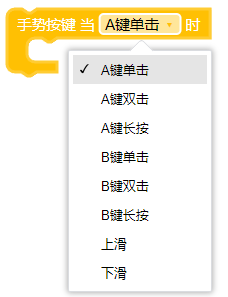
1. 该积木用于自定义手势按键的功能
2. 每个手势按键都自带默认功能,详情见[Leight 产品手册](/smartProducts/Leight).程序中自定义后会覆盖默认功能
3. 该积木为<事件>,执行后不需要套入循环内就能一直生效,事件内使用外部变量需先声明全局变量.

### 输入-语音指令
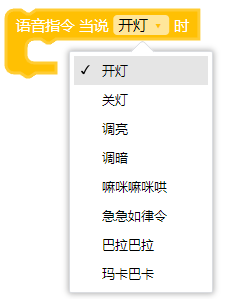
1. 该积木用于自定义语音指令的功能
2. 前四个语音指令都自带默认功能, 程序中自定义后会覆盖默认功能
3. 该积木为<事件>,执行后不需要套入循环内就能一直生效,事件内使用外部变量需先声明全局变量.

### 输出-设置亮度

1. 该积木用于设置台灯灯光亮度
2. 可设置的范围在0到100

### 输出-开/关灯

1. 这两个积木用于开/关灯
2. 开关灯自带对应动画,该动画为独立运行
3. 如果需要反复开关灯,需要在开关灯积木后加上'等待积木'

### 输出-rgb灯
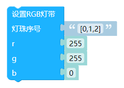
1. 该积木用于设置台灯上三个rgb灯的颜色
2. 灯珠序号为列表,列表内填入rgb灯的序号,第一个rgb灯序号为0
3. r,g,b这三个参数来控制颜色,范围0到255,全为0时代表熄灭

### 输出-播放音调

1. 该积木用于播放指定时长指定频率的和弦
2. 频率是个列表,只给一个频率也能播放
3. 这个积木是阻塞的,直到持续时间结束

### 输出-投射字符

1. 该积木用于投射单个字符(仅数字与英文字母)
2. 参数内不可输入多个字符,否则会报错

### 输出-走马灯

1. 该积木用于投射字符串的走马灯动画
2. 走马灯会从右往左自动循环播放
3. 该积木是非阻塞的,独立运行的.如果需要停止走马灯或使用其他灯光控制,请先使用停止走马灯积木

### 输出-停止走马灯

1. 该积木用于停止走马灯动画
2. 走马灯动画的优先级很高,且独立循环运行,需要对灯光进行其他操作时需先使用此模块

### 输出-投射点阵
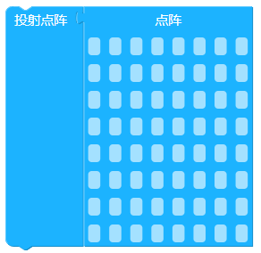

1. 该积木用于投射自定义点阵图案
2. 台灯的光线是由8*8的灯珠点阵组成,通过这个组件可以自由控制台灯上的每个灯珠的状态  
3. 在程序开头使用时建议加上等待积木等待0.5-1秒
:::tip
刷入新程序时台灯会重新启动,重启后会执行开/关灯,而开/关灯本身自带动画效果,且该动画是独立运行的.  
投射点阵速度较快,如果这个积木出现在程序开头,可能会被运行较慢的开/关灯覆盖
:::

### 网络-mqtt连接
::: tip MQTT
mqtt代码中有许多参数需要填写，在此先简单介绍下mqtt的各种概念，方便理解。

* mqtt可以简单理解为是一个聊天群
* client_id是一个不重复的用户名
* topic（主题）则为聊天群的群号，监听topic则可以理解为通过群号加入群聊，加入群聊后方可接收到消息
:::

1. 该积木用于连接到mqtt服务器
2. clientID需前往iot平台获取
3. 连接mqtt服务器之前需要先连接wifi

### 网络-mqtt发送消息

1. 该积木用于往指定主题中发送消息
2. 使用之前需先连接wifi和mqtt服务器
3. 如果要给他人的主题发送消息,请确保clientID在他人的设备列表中,或者该主题的白名单保护已关闭

### 网络-mqtt监听消息

1. 该积木用于监听指定主题是否有新消息
2. 当监听到有新消息时会自动执行内部的代码
3. 通常一个设备只作为发送端或接收端其中之一. 在测试学习时如要自己发送自己接收,那么应当在发送消息之前先监听
4. 该积木为<事件>,执行后不需要套入循环内就能一直生效,事件内使用外部变量需先声明全局变量.

### 网络-mqtt接收消息

1. 该积木用于从mqtt接收一次消息
2. 根据mqtt的特性,接收消息只会接收最新的消息,如果没有新消息会返回空消息`None`.并且新消息如果没有被及时接收会被服务器丢弃.
3. 为了及时接收且不接收空消息,该积木通常搭配监听消息这个事件积木使用,而不是`while`
4. 如果要对接收到的消息内容进行处理,那么建议将消息赋值给变量

#### 示例
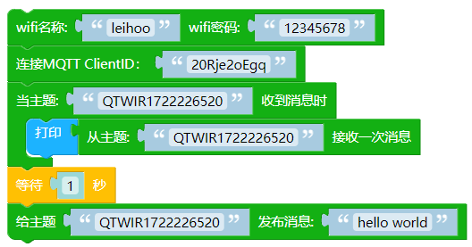

如上图所示,该程序为一个mqtt测试程序. 首先,连接wifi和mqtt服务器.  
接着,监听主题,监听事件为打印消息.  
最后等待一秒给主题发送消息.  
结果: 连接wifi成功->连接mqtt服务器成功->一秒后,消息推送成功->shell中打印了hello world

### 广播-初始化广播

1. 该积木用于初始化广播模块
2. 广播初始化后会自动开启广播
3. 用户可自行设置数字识别码,只有识别码相同的广播才能进行通信

### 广播-开/关广播
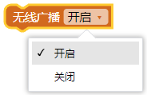
1. 该积木用于手动开关广播模块
2. 非特殊需求的情况下不需要使用该积木来开关广播

### 广播-发送消息

1. 该积木用于发送广播消息
2. 一台设备只能选择发送端或接收端其一.如果选择了发送消息,强烈建议不要再添加监听广播积木.

### 广播-监听消息

1. 该积木用监听广播是否有新的消息
2. 当监听到有新消息时会自动执行内部的代码
3. 一台设备只能选择发送端或接收端其一.如果选择了监听消息,强烈建议不要再发送消息的积木.
4. 该积木为<事件>,执行后不需要套入循环内就能一直生效,事件内使用外部变量需先声明全局变量.

### 广播-接收消息

1. 该积木用于从广播中接收一次消息
2. 广播的消息也需要及时接收,否则会被丢弃或被新消息覆盖.当没有新消息时却接收消息会返回空消息`None`
3. 为了及时接收且不接收空消息,该积木通常搭配监听消息这个事件积木使用,而不是`while`
4. 如果要对接收到的消息内容进行处理,那么建议将消息赋值给变量

#### 示例

* 图1 发送端
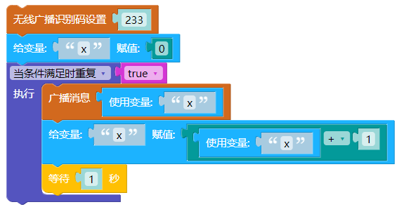  

* 图2 接收端  

如上两图所示,分别是发送端和接收端的程序.其数字识别码均为233,所以可以通信  
发送端中,我们设置了变量x为0,并编写了一个一直循环.循环体中,每次广播消息后x自增1,接着等待1秒继续循环.  
接收端则比较简单,单纯的将新消息打印. 
结果: 每隔一秒,接收端的shell会打新的不断增长的数字.  

### 时间-同步时间

1. 该积木用于和服务器同步时间,时区为+8时区
2. 使用此积木前需要连接wifi
3. 同步时,受wifi信号质量影响可能会同步失败,可多次尝试

### 时间-当前时间

1. 该积木用于输出系统的当前时间
2. 如果没有同步时间,那么所给的时间会从2000年1月1日 0:0:0开始(设备启动的时候)

### 时间-闹钟

1. 该积木用于设定一个闹钟,当到时间时执行事件
2. 如果没有同步时间,那么所给的时间会从2000年1月1日 0:0:0开始(设备启动的时候)
3. 该积木为<事件>,执行后不需要套入循环内就能一直生效,事件内使用外部变量需先声明全局变量.

### 时间-定时器

1. 该积木用于设定一个定时器,每隔指定的时间执行一次事件
2. 新的定时器事件会覆盖上一个定时器事件
3. 定时器是非阻塞的
4. 该积木为<事件>,执行后不需要套入循环内就能一直生效,事件内使用外部变量需先声明全局变量.

### 时间-中断定时器

1. 该积木用于中断定时器

